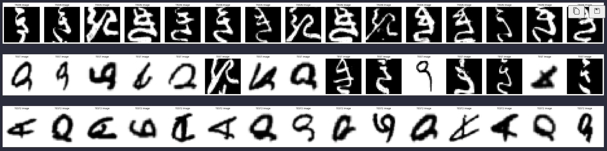

# Numpy array images classification
This project aimed to train different classification neural network models (VGG, ResNet, EfficientNet, HybridVGGResNet) using several TRAIN datasets and evaluate it on several TEST datasets.

github repository: https://github.com/stDem/ANN-numpy-array-images

This assignment consits of the following files/folders:

- TEST, TEST2, TRAIN - originally provided datasets;
- TRAIN2 - dataset consists of initial train dataset and initial train dataset with reversed color. Uses for the 2nd step in task1;
- TRAIN3 - dataset consists TEST2 dataset, but including only images with white background. Uses for task2;
- dataset-view.ipynb - consists of data analization, such as dispalying 15 examples of originally provided datasets (TRAIN, TEST, TEST2), pixel intensity distribution, mean plots;
- main.ipynb - implementation of task1;
- main2.ipynb - implementation of task2;
- readme.txt - combination of all steps, comments, explanations, and results. Mostly you can read the same notes among  code in .ipynb files, but here I tried to combine everything.
- taskDescription.txt - initially provided readme.txt with tasks description.

Datasets examples

======================================================
1. Data analization.
"./datasets-view.ipynb"

  1) From dispalying 15 examples of originally provided datasets we can see that TEST and TEST2 datasets include symbols not present in the TRAIN dataset (with reversed color - white backgroung with black symbol) and TEST2 dataset doesn't represent TRAIN dataset at all, but has the similar symbols as in the TEST dataset.

  2) Pixel Intensity Distribution: Visualizes the histogram of pixel intensities for each image in the train, test, and test2 datasets.
  Here we can see that:
  - train dataset has about 20% white pixels and 80% black respectively. That means that most likely all images in train dataset have black background with white symbol;
  - test dataset has pixels distribution about 50%/50%. That means that almost a half of test images has white backgroung with black symbols, and test dataset has two completely different symbols types;
  - test2 dataset has about 10% black pixels and 90% white respectively. That means that most likely all images in test2 dataset have white background with black symbol.

  3) Mean plots (Computes and displays the average of pixel intensities across all training and testing images).

  Here we can see approximate symbols shape of each class of each dataset and also can that train dataset has black backgroung, test dataset has 50%/50% black/white background, and test2 dataset has white background.

  CONCLUSION:
    The datasets are structured as train and test, consisting of images each with dimensions of (1,28,28), indicating that each example is a grayscale image with dimensions 28x28 pixels (1 is the number of channels in the image. For grayscale images, C = 1, while for color images, C = 3 (representing red, green, and blue channels)).
    Both the train and test datasets have the same shapes and data types. so there are no issues with data format or compatibility for model training and testing.

  Advantages of datasets:
    - big enough;
    - all train, test, and test2 datasets have labels (good for evaluation);
    - all train, test, and test2 datasets have the same amount of labels (no class mismatch) and the same amount of images in each label (no imbalanced).

  Disadvantages of datasets:
    - test and test2 datasets include symbols not present in the train dataset (with reversed colors - white backgroung with black symbol). test dataset includes two completely different symbols types compare with train dataset;
    - test2 dataset doesn't represent train dataset at all, but has the similar symbols as in the test dataset.

2. Task 1. 
"./main.ipynb"

  Step 1. Training 3 models (VGG, ResNet, and EfficientNet) on TRAIN dataset and evaluating on test dataset. Based on results was traing one more model - hybris of VGG and ResNet. I have models with with relatevely simle structure, because I wanted to try a lot of things (like different models, hyperparameters, normalization, datasets, and etc.), so even though I train models on GPU it takes some time, so I decided to use as simple architecture as possible.

  After the firt iteration looking on loss curves I noteced that I have overfitting. I tried to prevent it by using dropout layers and adding early stopping (Stop training if validation loss stops improving for 2 epochs), applying L2 Regularization  weight_decay=1e-4 (eventually removed). We cannot use rotation for data augmentation, because we have smth like hieroglyphs and if we rotate them they can represent another class.
  
  Step 2.
  We have bad accuracy as expexed (57% in average). What can we do:
  1. Create new train dataset consists of initial train dataset and initial train dataset with reversed color (TRAIN2 dataset).
  2. Train model again using new train dataset.
  3. Try different hyperparameters and normalization.

  After all changes I got the best result:

                            trained/evaluated  |  VGG | ResNet | EfficientNet | VGG+ResNet |
                            ================================================================
                            TRAIN/TEST         | 0.59 | 0.57   |    0.57      |   0.57     |
                            TRAIN2/TEST        | 0.53 | 0.55   |    0.54      |   0.57     |

  Using new TRAIN2 dataset I got worse result (55% in average). That means that TEST dataset has one more type of symbols which is not in train dataset.
  I tried differnt normalization, such transforms.RandomRotation(10), transforms.RandomAffine(0, shear=10, scale=(0.8, 1.2)), but the best accuracy in both steps I got only using transforms.Normalize((0.5,), (0.5,));
  Also tried increase the number of filters (64 instead of 32), but got quite the same result, so I left 32 as was initially.

  What could you advise to client? I would recommend to increase train dataset with missing symbols. If possible then move these symbols in separate class and train it on new dataset contains only these symbols. Because now in test dataset we have 2 different types of symbols for each class which confuse models.

3. Task 2.
"./main2.ipynb"

  Step 1. Evaluating the same models on TEST2 dataset. I expect very bad accuracy, because TRAIN dataset doesn't include symbols types represented in TEST2 dataset at all.
  Result:

                          trained/evaluated  |  VGG | ResNet | EfficientNet | VGG+ResNet |
                          ================================================================
                          TRAIN/TEST2        | 0.22 | 0.19   |    0.15      |   0.14     |

  We have very bad accuracy as expexed (got max 22% on VGG model). What can we do:
  1. Train models on TEST dataset. From data analysis we can see that TRAIN dataset doen't represent TEST2 dataset at all, so for futher training I won't use TRAIN dataset;
  2. To impove accuracy, as the second step, I can also clear TEST (which is train in this task) from images with black background (as TEST2 dataset consists only of white-background images presented only in TEST dataset). Here I expect better accuracy;
  3. Try different normalization.

  Step 2. Training model on TEST dataset and evaluating on TEST2 dataset.
  For last 2 steps I added  transforms.RandomResizedCrop(28, scale=(0.85, 1.0)) for normalization which crops a region of the image and to improve model generalization.
  I got maximum result 97% on Hybrid VGG and ResNet model, 95% in average.
  Lets try to remove all images with black background for training

  Step 3. Training models on TRAIN3 dataset consists only of images from TEST dataset with white backgroung and evaluating on TEST2 dataset. Here I also got maximum result 97% on Hybrid VGG and ResNet model, but other models performes better, so 96.25% in average.

The final accuracy results from both tasks and each step are as following:

                            trained/evaluated|  VGG   | ResNet | EfficientNet | VGG+ResNet |
                            ==================================================================
                            TRAIN/TEST       |  0.59  |  0.57  |    0.57      |   0.57     |
                            TRAIN2/TEST      |  0.53  |  0.55  |    0.54      |   0.57     |
                            TRAIN/TEST2      |  0.22  |  0.19  |    0.15      |   0.14     |
                            TEST/TEST2       |  0.96  |  0.92  |    0.95      |   0.97     |
                            TRAIN3/TEST2     |  0.96  |  0.96  |    0.96      |   0.97     |

COUNCLUSION: all models gives relatively the same results for each single step. However, we can see that VGG+ResNet model behaves consistently well for almost all tasks, because the hybrid model combines feature extraction from VGG with deep learning stability from ResNet. 

=======================================================================
I tried to use the most popular models. I also read some papers  . Some theory.

1. VGG.
  VGG (Visual Geometry Group) network, which was originally introduced in VGG16/VGG19 for large-scale image classification. The key idea behind VGG is using stacked small 3x3 convolutional filters to extract hierarchical features while preserving spatial information.
  The VGG architecture follows a simple deep feedforward CNN structure:
    - Uses multiple small (3x3) convolutions instead of larger kernels.
    - Includes max pooling layers to progressively reduce spatial dimensions.
    - Ends with fully connected layers for classification.
  In my VGG I have:
    - Two convolutional layers (Conv2d) followed by activation ReLU
    - MaxPooling layers to reduce spatial dimensions.
    - A fully connected classifier that maps extracted features to class predictions.
  Why good?
    - Good for feature extraction using hierarchical convolutional layers.
    - Simple and computationally efficient compared to deeper models like ResNet.
    - Works well for small datasets (1x28x28 grayscale images).

2. ResNet. 
  ResNet (Residual Network) architecture, which was introduced in ResNet-18, ResNet-34, ResNet-50, etc. The key idea behind ResNet is the use of residual connections (skip connections) to allow deeper networks to train effectively without vanishing gradients.
  Why good?
    - Traditional deep networks (like VGG) suffer from vanishing gradients when they become too deep.
    - ResNet solves this by introducing "skip connections" that allow the gradient to flow directly through layers.
    - These skip connections help preserve information, making deep networks trainable.
  Residual Block Formula
    A residual block in ResNet can be written as: 
        y = F(x) + x
    where:
      x = input
      F(x) = transformation applied by convolutional layers
      x + F(x) = the final output
    This allows the network to learn identity mappings, making training deeper networks easier and more stable.
  In my ResNet I have:
    ResNetBlock
      - Applies two convolutional layers (Conv2d).
      - Adds the input (residual connection) back to the output.
      - Allows gradients to bypass non-linear layers, making deeper networks easier to train.
    First Residual Block (layer1)
      - Input: 1x28x28 (grayscale image) → Output: 64x28x28.
      - Uses skip connections to retain important features.
    Max Pooling
      - Reduces spatial dimensions (28x28 → 14x14).
    Second Residual Block (layer2)
      - Increases depth (64 → 128 channels).
    Fully Connected Layer
      - Flattens features and classifies the symbol.

3. EfficientNet.
  EfficientNet architecture was introduced by Google in 2019. EfficientNet is designed to be computationally efficient while maintaining high accuracy, making it ideal for small datasets (1x28x28 grayscale images).
  Why good?
    - Standard CNN architectures (like VGG and ResNet) scale models inefficiently by just adding more layers.
    - EfficientNet introduces "compound scaling", which optimally balances depth, width, and resolution.
    - It achieves higher accuracy than ResNet/VGG while using fewer parameters.

  Feature Extractor (self.features)
    - Uses smaller convolutional layers (3x3 kernels).
    - Batch normalization stabilizes training.
    - Max pooling reduces spatial size efficiently.
  Classifier (self.classifier)
    - Uses a single dense layer with dropout to prevent overfitting.
    - Fewer parameters compared to VGG or ResNet, making it lightweight.

4. HybridVGGResNet
  My HybridVGGResNet model is a combination of VGG-like and ResNet-like architectures. This hybrid approach leverages the strengths of both networks:
    - VGG-like networks are great at feature extraction through sequential convolutional layers.
    - ResNet-like networks use residual connections to enable deep learning without vanishing gradients.
  By combining these two models, my hybrid network should benefit from both deep feature extraction and stable gradient flow.
  Feature Extraction with VGG
    - The VGG part extracts features sequentially using stacked 3x3 convolutions and max-pooling.
    - Good for detecting edges, textures, and shapes.
  Feature Extraction with ResNet
    - The ResNet part uses residual connections to allow deep feature learning.
    - Helps prevent vanishing gradients in deeper layers.
